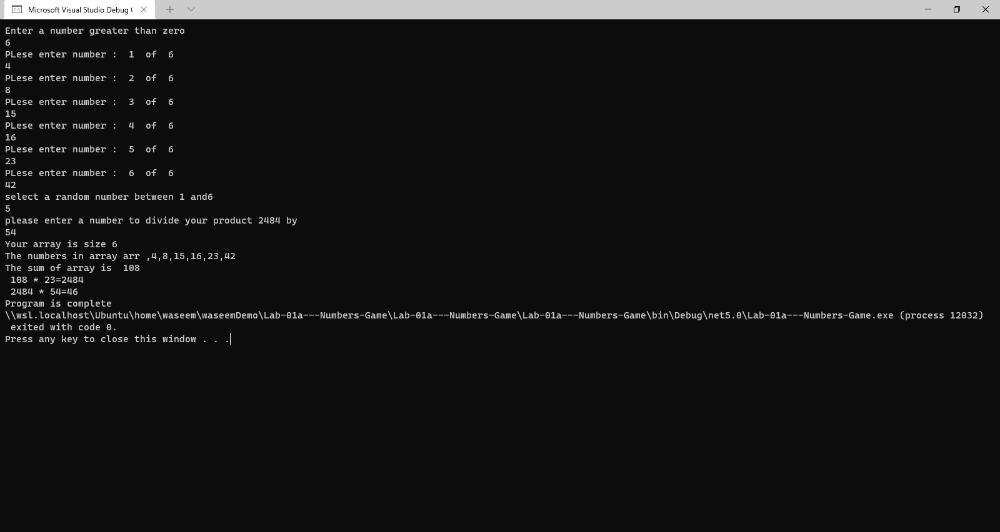

# Lab-01a---Numbers-Game
What is the purpose of the program?
 math game that takes user input, manipulates data, and utilizes error handling, by following the given the specifications.

What does the program look like? (visual)

